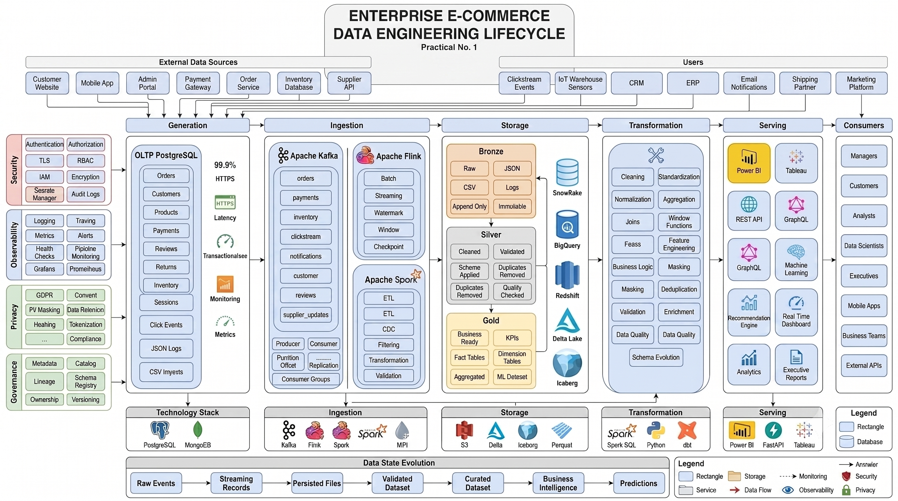

# Practical 1 — Enterprise E-Commerce Data Engineering Lifecycle

## Aim

Study, dissect, and map the complete end-to-end data engineering lifecycle for an enterprise e-commerce platform — tracing how data changes state across **Generation → Ingestion → Storage → Transformation → Serving**, while accounting for the cross-cutting undercurrents of **Security, Observability, Privacy, and Governance**.

## Problem Statement

Design an end-to-end architecture diagram representing:

- **Generation** — where data is created (transactional DB, web/app events, third-party feeds)
- **Ingestion** — how data moves into the platform (streaming + batch)
- **Storage** — where data rests, layered by quality (Bronze/Silver/Gold)
- **Transformation** — how raw data becomes business-ready data
- **Serving** — how processed data reaches dashboards, APIs, and end users

...while enforcing, at every stage: **Security**, **Privacy**, **Observability**, and **Governance**.

## Tools Used

`Draw.io` · `Git` · `GitHub` · `Markdown`

## Architecture

- [`architecture/enterprise_data_engineering_lifecycle.drawio`](./architecture/enterprise_data_engineering_lifecycle.drawio) — editable diagram
- [`architecture/enterprise_data_engineering_lifecycle.png`](./architecture/enterprise_data_engineering_lifecycle.png) — exported image
- [`architecture/architecture_notes.md`](./architecture/architecture_notes.md) — section-by-section explanation of the diagram
- [`architecture/design_rationale.md`](./architecture/design_rationale.md) — **why** it's built this way, not just what it is: trade-offs, failure modes, and what the diagram deliberately leaves out



## Lifecycle Walkthrough

```
GENERATION
  Customer interactions (website, mobile app)
  Orders, Payments, Inventory updates
  Clickstream events, third-party webhooks
        │
        ▼
INGESTION
  Apache Kafka   → real-time event streaming
  Apache Flink   → continuous stream processing
  Apache Spark   → batch + micro-batch processing
        │
        ▼
STORAGE  (layered by trust/quality)
  Bronze  → raw, untouched, append-only
  Silver  → cleaned, validated, deduplicated
  Gold    → business-ready, aggregated, query-optimized
        │
        ▼
TRANSFORMATION
  Cleaning & standardization
  Validation & data quality checks
  Business logic (LTV, dynamic pricing, recommendations)
        │
        ▼
SERVING
  Power BI / Tableau dashboards
  REST / GraphQL APIs
  Machine learning & recommendation engines
```

Every arrow above also passes through the **Security / Privacy / Observability / Governance** rail — see the manifesto for what that means concretely.

## Sample Dataset

[`datasets/`](./datasets) has a mock relational schema, a sample clickstream JSON payload, and a sample inventory CSV. These exist to make the **Generation** stage concrete — an abstract box labeled "OLTP PostgreSQL" is easy to nod along to and not actually understand; a real `orders` table with real columns forces you to reason about what's actually flowing downstream (and what counts as PII that Privacy controls need to catch).

## System Manifesto

[`manifesto/system_manifesto.md`](./manifesto/system_manifesto.md) — the security, privacy, observability, and governance principles this architecture is designed to satisfy.

## Supplementary Problem — Smart City IoT Traffic Sensor Platform

Mapping the same five stages onto a **continuous real-time streaming** IoT use case:

| Stage | Smart City Traffic Sensor Mapping |
|---|---|
| **1. Generation** | Thousands of roadside sensors/cameras continuously emitting telemetry (vehicle count, speed, congestion level) every 1–5 seconds — always-on, high-volume, no "off" state |
| **2. Ingestion** | MQTT/Kafka-based streaming ingestion built for **out-of-order and late-arriving data** (sensors on unreliable cellular links), with edge buffering to survive network drops |
| **3. Storage** | Time-series-optimized storage (e.g. a Bronze raw event store + a time-series DB like InfluxDB/TimescaleDB for Silver), partitioned by sensor ID and time window rather than by business date |
| **4. Transformation** | Real-time stream processing (Flink/Spark Structured Streaming) computing rolling aggregates — average speed per intersection per minute, congestion scoring — instead of nightly batch jobs |
| **5. Serving** | Low-latency serving to traffic-signal control systems and a live public congestion map; sub-second freshness requirements, unlike e-commerce BI dashboards which tolerate minute/hour-level latency |

**Key differentiator from the e-commerce case:** the IoT platform has **no natural batch
window** — data generation, ingestion, and serving all happen continuously and
simultaneously, which pushes storage/transformation toward stream-native tools rather
than the batch-friendly Bronze/Silver/Gold cadence used above, and raises the bar on
observability (sensor-health monitoring, late-data handling) as its own first-class
concern.

---

## Key Questions Answered

**1. How do downstream serving needs influence early generation/ingestion/storage decisions?**
The serving layer's latency and query needs are decided *first*, then everything upstream is built to satisfy them. If Serving needs a live inventory dashboard, Ingestion can't be an overnight batch job — it must stream through Kafka + Flink. If Serving needs deep historical trend analysis, Storage needs a well-structured Gold layer with fact/dimension tables, which forces Transformation to enforce schemas early. Serving requirements are the *starting point* of the design, even though they sit at the end of the diagram.

**2. Broader "data lifecycle" vs. the technical "data engineering lifecycle"?**
The **broader data lifecycle** is a business-wide view: how data is created, used, archived, and eventually deleted — including legal retention and organizational strategy, most of which an engineer doesn't directly control.
The **technical data engineering lifecycle** (Generation → Ingestion → Storage → Transformation → Serving, shown in this diagram) is the engineering *subset* of that: the pipelines, tools, and infrastructure decisions engineers build to move and shape data. It sits inside the broader lifecycle but doesn't cover things like legal data retention policy on its own.

**3. How should security & observability be enforced at each lifecycle boundary?**
At every handoff between stages:
- **Security** — authenticate the sender (mTLS/SASL for Kafka, IAM roles for cloud storage), encrypt data in transit and at rest, enforce least-privilege access (RBAC) so only the next stage's service can read/write.
- **Observability** — emit metrics at the boundary itself (consumer lag, error rate, schema-validation failures, storage volume) so a break is caught at the handoff, not discovered later when a downstream report looks wrong.

## Key Learnings

- Enterprise architecture thinking (designing before building)
- Streaming vs. batch data movement, and when each is the wrong choice
- Layered/lakehouse storage design (Bronze/Silver/Gold) and why immutability matters
- Where security/privacy/observability actually have to be enforced, not just listed

